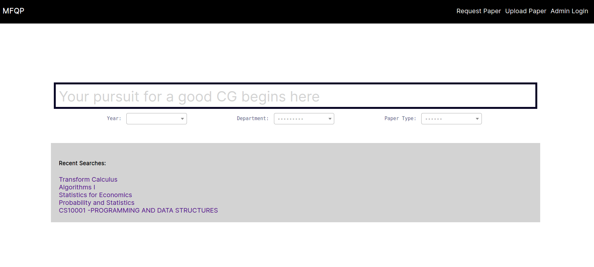

Usage
#####

The main user interfaces are described as follows:

1. Searching for a Question Paper
*********************************

Searching is done through AJAX. It uses debounced calls to our API.
Several filters can be added as shown in the image.

Besides, user can search for papers which are tagged with specific keywords.
Those keywords are defined by the uploader while uploading the papers
or added by the admin.

5 most recent search histories are also shown. These are stored in browser local storage.

2. Uploading a paper
********************

.. image:: _static/upload.png
   :width: 400

Uploading a paper is done one at a time for a normal user by the interface as shown above.
Keywords to be considered while adding papers:

- Difficulty: Hard/Easy

- Concepts covered

- Paper setter etc.

The uploaded papers are sent to Google Drive.

However, occassionally admin needs to scrape paper links from the Library Site and add them in a bulk.
For that, specifically for admin, a bulk upload interface is present.

.. image:: _static/upload_elevated.png
   :width: 400

3. Requesting a paper
*********************

.. image:: _static/request.png
   :width: 400

Here users can request papers if not found.

4. Login and Registration
*************************

Users are NOT enforced to create an account to perform the above tasks.
This is done to cut the overhead time, thereby improving User Experience.
However, they can still create an account to let us know who are the curators of the page.

The login system thereby serves as an entrypoint for the admin to log in.

.. image:: _static/login.png
   :width: 400

.. image:: _static/register.png
   :width: 400

5. Search API
*************

Besides these graphical interfaces, we also provide a JSON API to ease integration with other apps.

The default route for it is: ``/search/api``.

Supports ``GET`` requests with the following parameters:

- ``q``: The search query (on subject name)

- ``year``: Year filter

- ``dep``: Department filter

- ``typ``: Paper type filter

- ``key``: Comma separated list of keywords to search for.
